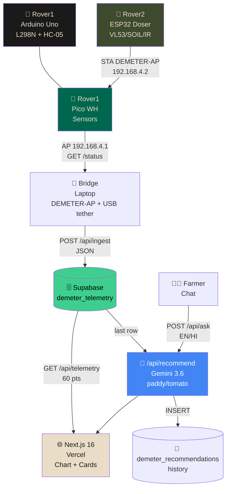
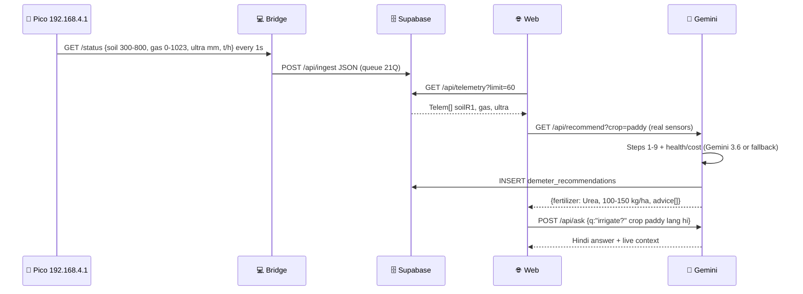
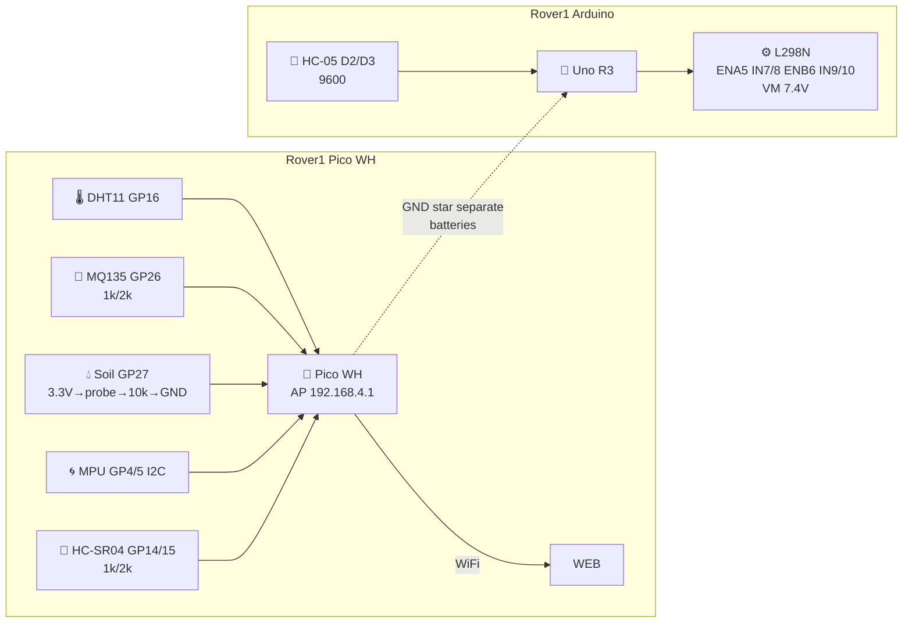
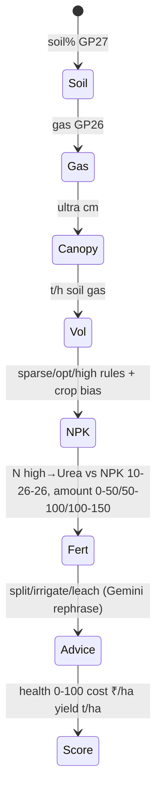

# 🌱 D.E.M.E.T.E.R — Dynamic Environmental Mapping & Targeted Emission Robotics

> **AgriSwarm:** *Precision Grown. Not Sprayed.* — Pico WH Scout + Arduino Remote + ESP32 Doser + AI

[](https://nextjs.org)
[](https://supabase.com)
[](https://ai.google.dev)
[](https://micropython.org)
[](https://web-nine-orpin-62.vercel.app)
[](https://web-nine-orpin-62.vercel.app)

**Pico WH** scouts `DHT11 • MQ-135 • Soil 10k pulldown • MPU • HC-SR04` and hosts `AP DEMETER-AP 192.168.4.1`. **Arduino Uno** drives 4WD via `L298N` + `HC-05 Bluetooth` remote. **ESP32** doser follows lines and micro-doses. **Web (Next 16 + Supabase + Gemini 3.6)** streams live telemetry, AI fertilizer advice for **2 crops**, farmer chat (EN/HI), health score & cost.

---

## 📑 Table of Contents

1. [✨ Features](#-features) 2. [🏗️ Architecture](#️-architecture) 3. [📁 Structure](#-structure) 4. [🔌 Hardware](#-hardware) 5. [🚀 Quick Start](#-quick-start) 6. [🌐 Web Live](#-web-live) 7. [🤖 AI Advisor](#-ai-advisor) 8. [🧪 Swarm Demo](#-swarm-demo) 9. [🔧 Troubleshooting](#-troubleshooting) 10. [📜 License](#-license)

---

## ✨ Features

| 🌾 Scout | 🤖 Doser | 🧠 Cloud AI |
|---|---|---|
| `Pico WH` 10Hz `t/h/gas/soil/ultra/tilt` `192.168.4.1/status` dashboard `Chart.js` | `ESP32` VL53 `Soil IR` `Vibrator D5→IRLZ44N` `L298N 4WD` | `Gemini 3.6-flash` Steps 1-9, health `0-100`, cost `₹/ha`, trend, `ask` chat EN/HI |
| `Soil 3.3V→probe→GP27→10k→GND` divider `dry low wet high` | `STA DEMETER-AP` `192.168.4.2/deploy?token` | `Supabase` `demeter_telemetry` + `demeter_recommendations` history, `Next API` `force-dynamic` |

---

## 🏗️ Architecture







---

## 📁 Structure

```
DEMETER/
├─ rover1-pi/              # 🌱 Scout MicroPython Pico WH (main.py + config.py) 192.168.4.1
├─ rover1-pico-arduino/    # 🔄 Arduino alt for Pico W (C++ WiFi, same pins)
├─ rover1-arduino/         # 🤖 Remote drive Uno R3 (L298N + HC-05 D2/D3)
├─ rover2-esp32/           # 🚜 Doser ESP32 unified (VL53 21/22 Soil33 IR 25/26/27 Vib5)
├─ rover2-uno/             # 📦 Legacy Uno archived
├─ web/                    # 🌐 Next 16 + Supabase + Gemini (src/lib/fertilizerAI.ts /api/recommend /api/ask)
├─ docs/pin-map.md         # 🔌 Pin maps + dividers
└─ README.md               # 📜 You are here
```

---

## 🔌 Hardware

**Rover1 4WD chassis**

| Sensor | Pico | Wiring | Icon |
|---|---|---|---|
| DHT11 | `GP16` | `10k→3.3V` `VCC 3.3V` | 🌡️ |
| MQ-135 AO | `GP26 ADC0` | `5V → 1k→GP26→2k→GND` `≤3.3V` | 💨 |
| **Soil probe** | `GP27 ADC1` | `3.3V→probe→GP27→10k→GND` `dry 300 wet 800` | 💧 |
| MPU-6050 | `GP4 SDA / GP5 SCL` | `I2C0 400kHz 3.3V` scan `[104]` | 🌀 |
| HC-SR04 | `GP14 TRIG / GP15 ECHO` | `TRIG 3.3V→5V OK` `ECHO 1k/2k→GP15` | 📏 |
| LED | `LED 25` | blink 600ms | 💡 |
| Power | `VSYS 5V` via `buck 5V 2A` `7.4V 2S` `1000µF` `GND star` | | 🔋 |

**Rover1 Arduino** `D5 ENA / D6 ENB / D7-10 IN` `HC-05 D2/D3 9600` `VM 7.4V` `GND star` — separate battery ideal.

---

## 🚀 Quick Start

### 1. Rover1 Pico WH

```bash
# Flash MicroPython RPI_PICO_W-*.uf2 hold BOOTSEL, then Thonny
# Copy rover1-pi/main.py as main.py + config.py to Pico, reset
# Must solder: MQ AO 1k/2k→GP26, ECHO 1k/2k→GP15, probe 10k→GND at GP27, verify ≤3.3V
# Thonny REPL:
from machine import Pin,ADC
print(ADC(Pin(27)).read_u16()>>6) # air ~300 wet ~800
```

Serial `AP active: ('192.168.4.1',...)` → WiFi `DEMETER-AP` `16042008`.

### 2. Rover1 Arduino Remote

```
IDE → Board Arduino Uno → rover1-arduino/rover1-arduino.ino → Upload
Serial 9600 type F → motors F, B back, L/R spin, S stop, V/v speed
Pair phone HC-05 (1234) → Bluetooth RC app → slide
```

### 3. Web Local

```bash
cd web
npm install
# .env.local
NEXT_PUBLIC_SUPABASE_URL=https://fpyjcpqudwvdhkfmyrzf.supabase.co
NEXT_PUBLIC_SUPABASE_ANON_KEY=eyJ...
NEXT_PUBLIC_PICO_URL=http://192.168.4.1
GEMINI_API_KEY=AIzaSy...  # Gemini 3.6-flash, server only
npm run dev
# http://localhost:3000  http://localhost:3000/api/health {"db":"connected"}
```

### 4. Web Hosted

```bash
npx vercel --prod --yes
# Vercel env: GEMINI_API_KEY + SUPABASE_URL/ANON_KEY production
# Live https://web-nine-orpin-62.vercel.app/api/health
```

---

## 🌐 Web Live

* `GET /api/health` → `{db, telemetry_rows, pico}`
* `GET /api/telemetry?limit=60&raw=1` → `{data: Telem[], raw}`
* `POST /api/ingest {t,h,gas,soil,ultra,...rover2{}}` → `demeter_telemetry`
* `GET /api/recommend?crop=paddy|tomato` → live `soil% gas ultra cm h t` → Gemini Steps 1-9 → `INSERT demeter_recommendations` + `health_score` `cost` `trend`
* `POST /api/ask {question,crop,lang:en|hi}` → Gemini farmer chat with live `soil1 gas 0 ultra 49` context

Bridge for live Supabase: laptop WiFi `DEMETER-AP` + phone `USB tether` internet → `BRIDGE ON` `synced 1` `POST /api/ingest 200`.

---

## 🤖 AI Advisor

**2 crops** 🌾 Paddy · 🍅 Tomato — `CROP` pills in `Telemetry`.



Gemini `gemini-3.6-flash` `v1beta generateContent` fallback deterministic if quota `429`.

---

## 🧪 Swarm Demo

Phone `DEMETER-AP` → `http://192.168.4.1/` → `Deploy Rover2 ?token=DEMETER2026` → `Pico GET 192.168.4.2/deploy` → `ESP32 RUNNING`.

* Zone A `soil 680 dist 120` → `pwm 255`
* Zone B `soil 300 dist 9999` → `pwm 0`
* Chart `Gas/Soil R1 vs Ultra vs PWM` inverse.

---

## 🔧 Troubleshooting

| Symptom | Fix |
|---|---|
| No AP | Thonny `main.py` not saved as `main.py` |
| `192.168.4.1 timed out` | WiFi not `DEMETER-AP` `ping 192.168.4.1` fail → rejoin |
| `CORS BRIDGE NetworkError` | Pico `http_response` `*` + `OPTIONS 204` `main.py:192`, keep `DEMETER-AP` + `USB tether` |
| `MPU fail ETIMEDOUT scan: []` | `SDA GP4 SCL GP5` swap, `VCC 3.3V`, `i2c.scan() [104]` |
| `soil 12 gas 0 ultra 9999` | `10k→GND` open, `GP27` floating, `ECHO 1k/2k` |
| `400 Validation failed soil` | Arduino `4095` → `>>2` `0-1023` `fertilizerAI normalizeAdc` |
| `localhost 404` | `cd web` `Remove-Item .next` `npm run dev` `http://localhost:3000/` not `/D.E.M.E.T.E.R` |

---

## 📜 License

Demo only — no secrets in repo, `.env` gitignored, RLS `anon true` for jury. Calibrate probe `300/800`, `GAS 300/600`, `ULTRA mount 35cm` per field.

*© 2026 D.E.M.E.T.E.R — AGRI-SWARM `web` `Next 16` `Supabase` `Gemini 3.6` `Pico MicroPython` `Arduino`*

